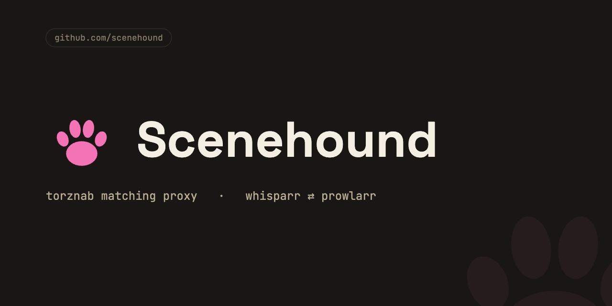

# Scenehound

Torznab matching proxy between [Whisparr v3] and [Prowlarr]. Whisparr searches
for scenes by exact `site + date`; private-tracker release naming is chaos.
Scenehound sits between them, resolves Whisparr's rigid queries against its own
scene metadata (title, performers, date, site), hunts the tracker via Prowlarr
with smarter query variants, scores every candidate, and returns matches with
canonical titles Whisparr can actually parse. Everything downstream — grabs,
downloads, imports — is stock Whisparr.

Design: `docs/plans/2026-07-11-scenehound-design.md`; held-import subsystem:
`docs/superpowers/specs/2026-07-12-import-completer-design.md`.

## How it works

    Whisparr ──torznab──▶ Scenehound ──torznab──▶ Prowlarr ──▶ trackers
                              └──REST──▶ Whisparr API (wanted list)

- **Search**: `thatfetishgirl 07.07.2026` → scene fingerprint → adaptive query
  variants → candidates scored (two independent strong signals required) →
  rewritten results returned.
- **RSS sync**: every new tracker upload is matched against your entire wanted
  list; recognised releases get canonical titles.
- **Any failure → passthrough**: results flow unmodified, never worse than stock.
- **Tracker-safe**: per-indexer token bucket (default: burst 4, one query per
  15 s sustained) on top of Prowlarr's own 2 s floor. Deliberately conservative.
- **Held-import completion** (opt-in, off by default): auto-triggers Whisparr's
  *"matched to movie by ID — Manual Import required"* holds via the Whisparr API.
  Fully isolated from the search path — a no-op when disabled. See
  [Auto-completing held imports](#auto-completing-held-imports-opt-in-off-by-default).

## Setup prerequisites

1. **Your Whisparr quality profile must allow "Unknown"** (Settings → Profiles).
   Quality filtering happens at grab time; honestly-rewritten releases with no
   quality tokens parse as Unknown and would otherwise be rejected before
   download. Scenehound never invents quality it can't see.
2. **Unassign the real tracker indexers from Whisparr** (keep them in Prowlarr
   for other apps). Whisparr should reach those trackers only through Scenehound,
   or you'll get duplicate results.

## Install (Unraid)

Scenehound is published as a container image on GHCR by CI on every push to
`main`:

    ghcr.io/espionage9248/scenehound:latest

The package inherits the repo's **private** visibility, so authenticate the
Unraid host's Docker to GHCR once (a Personal Access Token with `read:packages`):

    echo <PAT-with-read:packages> | docker login ghcr.io -u <github-username> --password-stdin

**Add the template.** Unraid only lists templates that live on the flash drive —
you can't point it at a template URL. Copy `unraid/scenehound.xml` onto the USB:

    /boot/config/plugins/dockerMan/templates-user/my-scenehound.xml

Then **Add Container → Template → scenehound** (under *User templates*). Fill in
the Whisparr/Prowlarr URLs and API keys (they're template env vars, not the
config file) and Apply — Unraid pulls the image from GHCR.

**Config.** Create `/mnt/user/appdata/scenehound/config.yaml` with just your
indexers (URLs + API keys come from the template env vars, not this file):

    indexers:
      - slug: empornium        # -> http://SERVER:9797/indexer/empornium/api
        prowlarr_id: 12        # Prowlarr indexer ID (visible in its URL when edited)
      - slug: happyfappy
        prowlarr_id: 15

**PUID / PGID**: default to `99` / `100` (Unraid's `nobody:users`). The
container runs as root only to `chown /config` to `PUID:PGID` on start, then
drops to that user — so no manual `chown` of the appdata path is ever needed.
Change PUID/PGID (both are advanced fields) only if your appdata directory is
owned by a different user.

Start the container, then read the Scenehound API key from
`/mnt/user/appdata/scenehound/apikey` (you'll need it below).

**Updating**: it's a pull, not a rebuild — Unraid's *Check for Updates* (or
*Force Update* on the container) fetches the newest `:latest` from GHCR.

## Add to Whisparr

For each indexer: Settings → Indexers → Add → Torznab:

- URL: `http://SERVER:9797/indexer/<slug>` (Whisparr appends `/api`)
- API Key: contents of the `apikey` file
- Categories: 6000

Press Test — a green check means the whole chain works. Run one interactive
search on a monitored scene and watch `docker logs scenehound`.

## Auto-completing held imports (opt-in, off by default)

Some grabs download fine but Whisparr holds them: *"matched to movie by ID —
Manual Import required"* (the tracker's original filename can't be scene-matched
at import time, so Whisparr falls back to the grab-history movie and its safety
rule holds the by-ID match for manual confirmation). Scenehound can auto-trigger
these. **Disabled by default; dry-run the first time you enable it.** It is fully
isolated from the search path — when disabled there is no webhook route and no
background task.

1. Add to `config.yaml`:

       import_completer:
         enabled: true
         dry_run: true      # logs the import it WOULD fire; flip to false when satisfied

2. In Whisparr → Settings → Connect → add a **Webhook**:
   - URL: `http://SERVER:9797/import/webhook?apikey=<contents of the apikey file>`
   - Method: `POST`; under Triggers, enable **On Manual Interaction Required**.
   - Press **Test** (Scenehound answers `200`, so the Connect saves), then **Save**.

3. Watch `docker logs -f scenehound`. In dry-run you'll see `DRY-RUN import …`
   lines showing the exact command that would fire. When they look right, set
   `dry_run: false`.

**Rollout ladder:** `enabled: false` → `enabled: true, dry_run: true` (observe the
logs) → `dry_run: false` (live).

Phase 1 handles **single-file** grabs behind a conservative gate: it only ever
confirms Whisparr's own by-ID decision (candidate movie id must equal the grabbed
movie id), requires zero import rejections, waits out a grace period to avoid
racing Whisparr, and retries a bounded number of times before parking a stuck
item. Imports always use `copy` mode, so qBittorrent seeding is never disturbed.

**Multi-file packs/siterips** are opt-in on top of phase 1 via an independent flag:

    import_completer:
      enabled: true
      multipack: true    # off by default; dry-run first, as above

Multipack is strictly **all-or-nothing**: Scenehound matches every video file in
the pack to a wanted scene (reusing the same matcher as the search path, at a
stricter confidence bar) and fires the import only if *every* file matches
uniquely. If any file is unmatched or ambiguous, the whole pack is left held and
a per-file verdict is logged, so finishing it by hand is a checkbox exercise.
This is deliberate: a partial import would let Whisparr discard the files it
didn't import — some of which may be scenes you wanted.

## Logs are the UI

    docker logs -f scenehound

`info` shows one line per search/RSS decision with scores. `debug` shows every
candidate's per-signal breakdown. A rejected match always says which signal
fell short. Wrong grab? The original tracker title is in the log line and in
the `scenehound_original_title` attribute of every rewritten result — add the
case to `tests/fixtures/corpus.yaml` and it becomes a regression test.

## Not in v1 (deliberate)

- External metadata providers (ThePornDB etc.) — the interface exists, nothing
  plugs in yet.
- Defeating tracker search's title-only retrieval for ancient backlog items:
  RSS catches things going forward; search mode is best-effort for the past.
- A web UI.

[Whisparr v3]: https://github.com/Whisparr/Whisparr
[Prowlarr]: https://github.com/Prowlarr/Prowlarr
